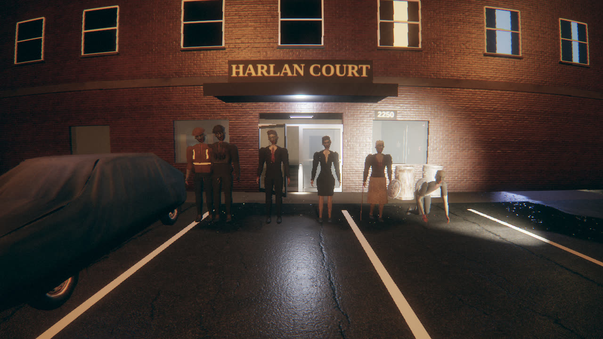
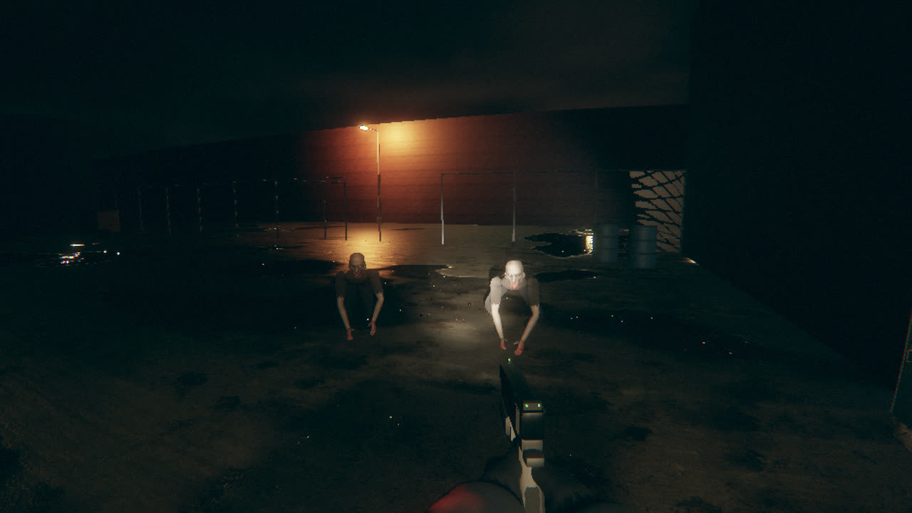
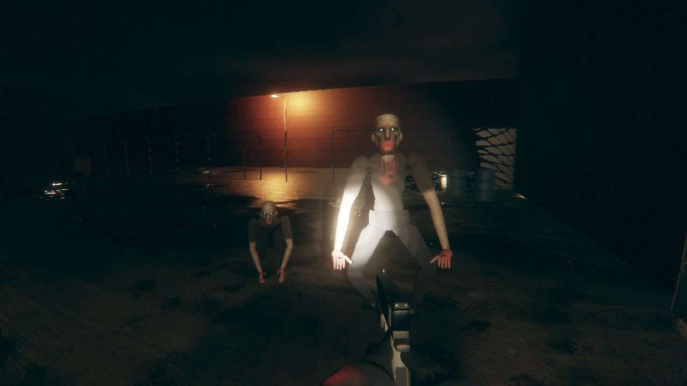
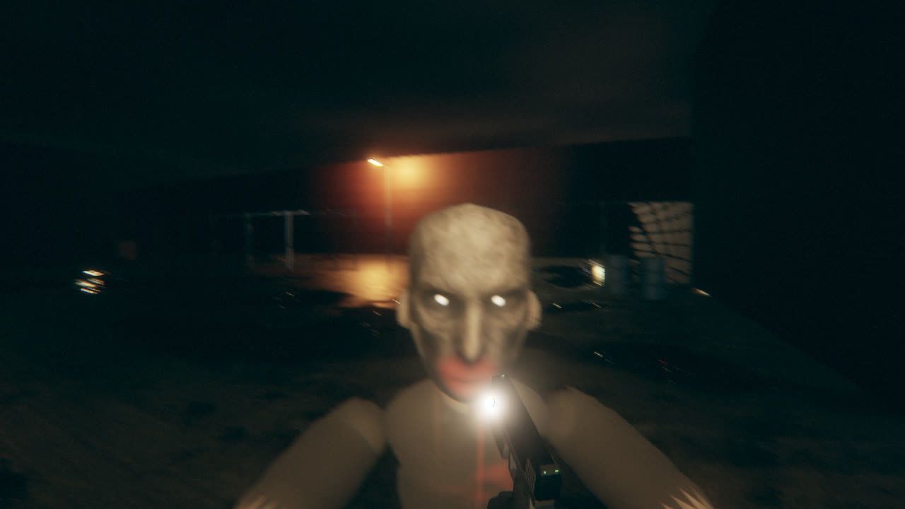
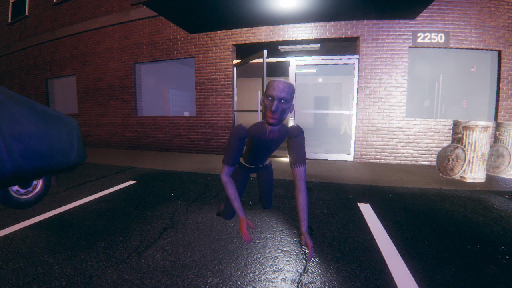
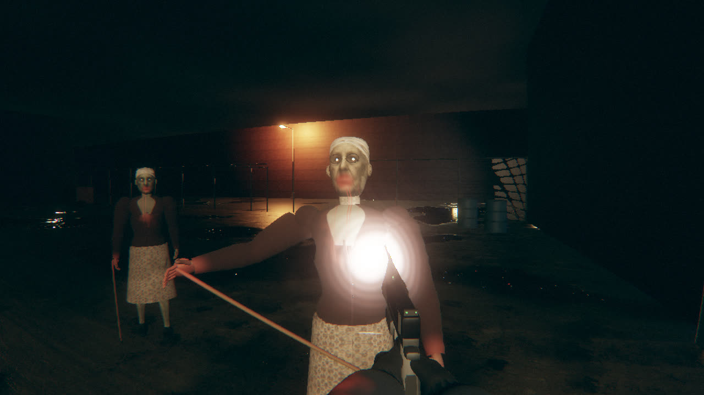
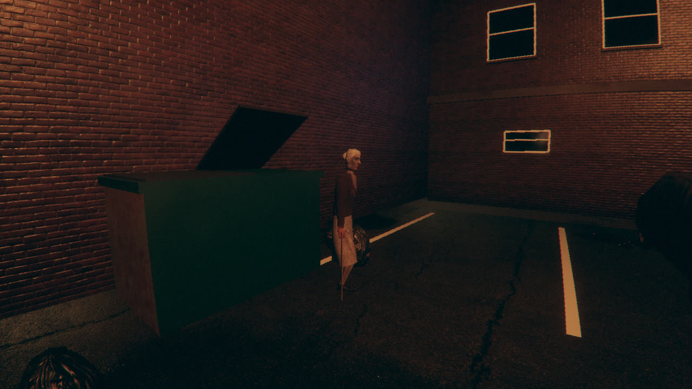
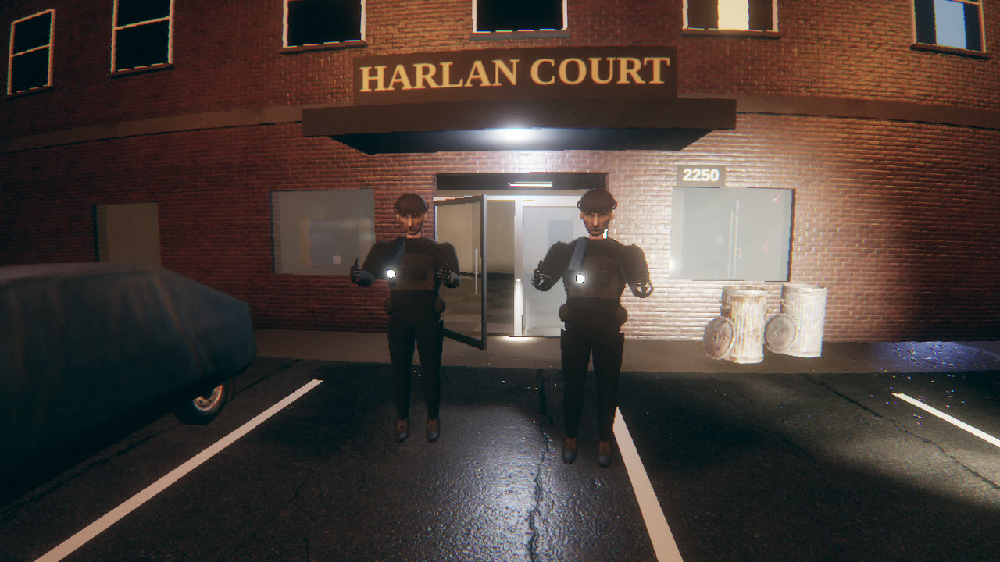
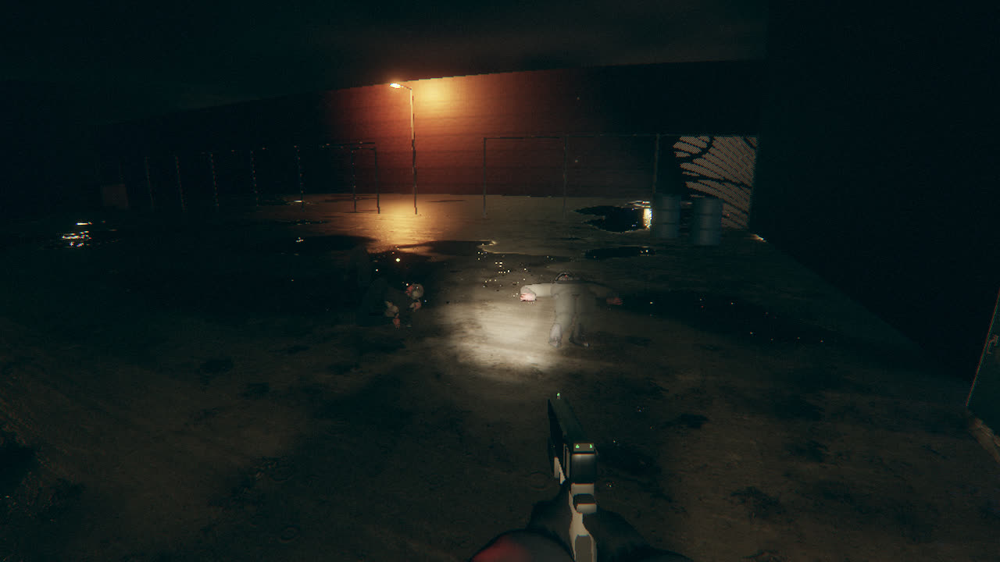

# Enemies: the Ashworth kit on the DEAD AIR skeleton

The infected (and the Keston SWAT officers in the finale) are the six characters of the
Ashworth Enemy Kit v2.0 (MIT, generated photographic atlases on parametric meshes, built for another
game). They run on the game's own 20-bone skeleton, so every existing system drives them unchanged:
procedural poses, hit reactions, capsule hit zones, verlet ragdolls, bullet wound splats, head
destruction, eye shine, portal culling and body LOD. `?enemies=sdf` brings back the procedural SDF
bodies; the game also falls back to them if the kit assets fail to load.

## Cast

Story spawns pick a template by `variant` slot (`story.js`); the kit fills them like this
(`Game.buildKitTemplates`):

| slot | kit enemy | where the story puts it | behaviour (`kitbody.js` `ARCHETYPES`, `zombie.js`) |
|---|---|---|---|
| 0 | industrial worker | feeding in the lot, lobby horde | heavy shambler, 130 HP, deep limp, arms low; the hardhat deflects shots above the brow |
| 1 | businessman | dormant in the office, laundry | erratic commuter: twitches, then sprints in bursts |
| 2 | grandmother | behind the 1B door, the lone figure on the menu, lobby | cane walk (kit clip over short shuffling steps), lurches when you are close, cane swing from 1.45 m |
| 3 | crawler | down the west corridor after 1B bursts, lurking in maintenance | on all fours, sprints at ~3 m/s, pounces from 3 m and latches on |
| 4 | businesswoman | laundry, west corridor | close-range stalker: tight pencil-skirt steps that speed up inside 4.5 m |
| 5 | businessman, brown suit | the attacker in 1C (the bite) | as slot 1 |
| 6 | tactical officer | courtyard waves only | armoured pursuer: plate carrier (torso ×0.45), helmet deflects above the brow; aim for the face |

The superintendent (1C victim who gets back up) is the worker without the hardhat, freshly dead. The
SWAT officers are the tactical kit alive, in black. Courtyard waves cycle through every slot.

| | |
|---|---|
|  |  |
|  |  |
|  |  |
|  |  |

## Pipeline

1. **Import** (`node tools/import_enemy_kit.mjs [kitDir]`, needs ffmpeg). Runs the kit's own
   procedural builder for `medium`, `low` and an added `far` resolution (the kit ships low and medium
   only; the tool patches a cached copy of the builder's resolution table), samples the crawler and
   cane clips at 30 fps and transcodes the atlases. Output in `assets/enemies/` (5.6 MB):
   quantised geometry with per-vertex atlas region IDs, clip frames, `<id>_d.jpg` albedo and
   `<id>_nr.jpg` (normal xy + roughness, 4:4:4 so the channels never bleed), `manifest.json`.
   The 108 MB source kit is not committed (`.gitignore`).
2. **Re-pose** (`kitbody.js`, once per template at load). The kit binds in a T-pose; the game
   animates an A-pose. Each mesh is re-posed into the game's bind pose with dual quaternion skinning.
   Around the shoulders the kit's torso shell keeps a flat T-pose shoulder line weighted to the chest,
   which stands up like a shoulder pad once the arm drops 66 degrees, so there the bake blends by
   position instead: the top of the torso droops with the clavicle, then ramps into the full arm
   rotation across the joint. Fingers are curled into claws. The 44 kit joints fold onto the 20 game
   bones (fingers onto the hand, toes onto the foot); the grandmother's cane keeps its own bone.
3. **Retarget clips.** With Q the re-posing world rotation of each kit joint, a kit local rotation L
   becomes `Q_parent · L · Q_joint⁻¹` on the game bone, stored as the game's ZXY euler channels.
   Verified against the kit's own forward kinematics: every joint lands within 1 mm.
4. **Material.** The kit atlas through `MeshStandardMaterial`, plus a zombie layer keyed on the atlas
   regions: pallor, mottling, bruises and veins on skin; sunken sockets and milky eyes on the
   registered face tile; mouth and chin blood running down onto the collar; grime, mud and palette
   tints on clothing (garments brought down to the value range of the game's fabrics); the game's
   dynamic wound splats in bind space; eye shine emitted from the face, driven through `Body.eyeMat`.

## The crawler

The kit's authored crawl is a knees-out squat with an upright torso: from eye level it reads as
someone sitting. `anim.js` `poseCrawl` replaces it: the torso is pitched low by FK and palms and knees
are placed on the floor with analytic two-bone IK from the template's own joints, stance and swing
driven by distance covered, prowling on hands and knees and blending into a knees-up bear crawl at
speed. From about three metres, with a clear line, it pounces with the kit's `windowLeap`, root motion
scaled to the gap; landing on you latches on (60 % chance, the shove QTE) or it drops and recovers.
Shots do not knock it out of the air; killing it mid-leap throws the ragdoll forward.

## Budgets

Twelve infected in the courtyard (5 near, 7 at distance LOD), same scene as `perf/README.md`'s heavy
phase, measured in the SwiftShader harness:

| preset | bodies | draw calls | triangles | sim JS |
|---|---|---|---|---|
| HIGH | kit | 92 | 369 k | 0.83 ms |
| HIGH | SDF | 104 | 513 k | 0.71 ms |
| LOW | kit | 90 | 245 k | 0.91 ms |
| LOW | SDF | 102 | 280 k | 0.94 ms |

Meshes: `medium` (18–24 k triangles) near from HIGH up, `low` (9–13 k) near below HIGH, `far` (4–7 k)
past 7 m everywhere; one draw per body (the eye meshes are gone). Atlases follow the preset texture
budget: albedo at the texture cap (256 px on LOW, 512 on MEDIUM, 1024 from HIGH), the normal +
roughness map only from HIGH up. That adds about 2 MB of resident textures on LOW, 8 MB on MEDIUM and
67 MB on HIGH, inside each preset's budget. A session downloads 3–4 MB of enemy data.

## Known limits

- The flashlight's hotspot saturates any body at about two metres, as it did with the SDF bodies.
- The kit faces are painted onto relief heads: no eyeballs or facial rig; jaw animation moves the chin
  only a little.
- Clothing is skinned, not simulated; extreme poses (feeding, the kneeling grab) can still show
  intersections, as the kit documents. Shoulders stay slightly square in the jacket outfits.
- The grandmother's cane walk plays the kit's upper body over procedural steps, so the cane tap is
  not phase-locked to a footstep.
